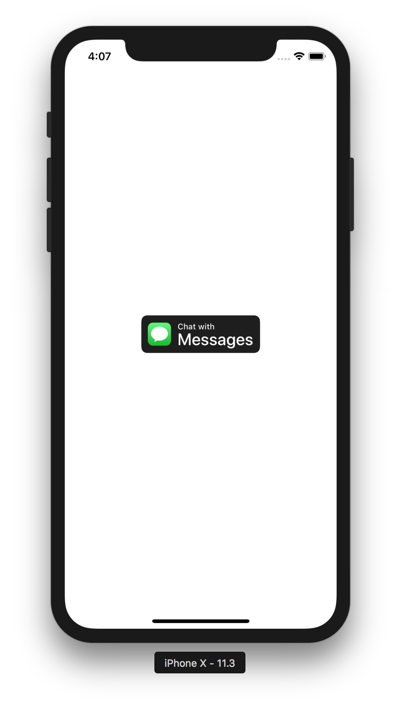

# iOS 11.3+ BusinessChat API

Let customers chat with your business using Messages in iOS 11.3+ and Titanium.

Business Chat lets customers chat directly with your business using Messages on their device,
and it lets you respond to those messages through your Customer Service Platform (CSP).
Your CSP implements the server-to-server API that makes it possible to send and receive
texts and photos, request payment through Apple Pay, and much more. Customers can even
start a chat from your app with the tap of a button.

Read more in the [Apple Docs](https://developer.apple.com/documentation/businesschat).



## Requirements

- [x] iOS 11.3+
- [x] Titanium SDK 7.1.0 (`appc sdk install -b 7_1_X`)
- [x] Hyperloop 3.1.0
- [x] A valid [Apple Business Chat Registration](https://register.apple.com/business-chat)

## Example

```js
import {
  TiBusinessChatButton,
  openTranscript,
  CHAT_BUTTON_STYLE_LIGHT,
  ACTION_PARAMETER_BODY,
  ACTION_PARAMETER_GROUP,
  ACTION_PARAMETER_INTENT
} from '/business-chat';

const win = Ti.UI.createWindow({
  backgroundColor: '#fff'
});

const chatButton = new TiBusinessChatButton(CHAT_BUTTON_STYLE_LIGHT, () => {
  Ti.API.info('Attempting to open transcript ...');

  // Replace "<your-business-id>" with the business ID received from Apple.
  // The method will log "[NSURLComponents initWithURL:resolvingAgainstBaseURL:]: nil URLString parameter" if the Business ID is invalid
  openTranscript('<your-business-id>', {
    ACTION_PARAMETER_BODY: 'missing_or_stolen_card',
    ACTION_PARAMETER_GROUP: 'credit_card_department',
    ACTION_PARAMETER_INTENT: 'I need to replace my credit card.'
  });
});

win.add(chatButton.instance);
win.open();
```

Or just run this app!

## License

MIT

## Author

Hans Knöchel ([@hansemannnn](https://twitter.com/hansemannnn) / [Web](http://hans-knoechel.de))
